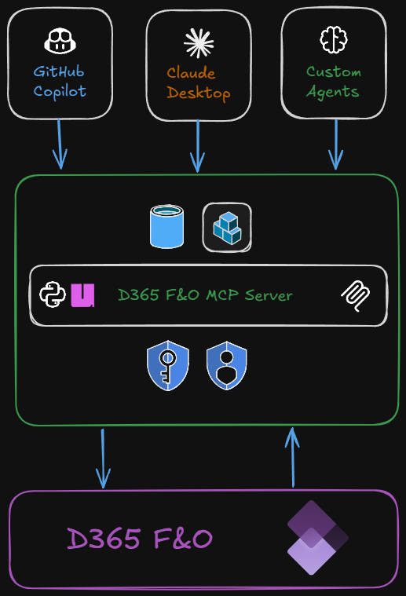

# Dynmics 365 Finance & Operations MCP Server Demo

A demonstration of the Microsoft Dynamics 365 Finance & Operations Model Context Protocol (MCP) server integration with VS Code and GitHub Copilot.


## 1. Introduction & Architecture

### What is D365FO Client MCP?

The D365FO Client & MCP server is a powerful integration tool that enables direct interaction with Microsoft Dynamics 365 Finance & Operations environments through VS Code  and GitHub Copilot using the Model Context Protocol. This tool provides:

- **Direct API Access**: Query and manipulate D365FO data entities through OData endpoints
- **Metadata Discovery**: Explore entity schemas, enumerations, and available actions
- **Real-time Operations**: Perform CRUD operations on D365FO data in real-time
- **Intelligent Assistance**: AI-powered suggestions and automation for D365FO development tasks

### Video Demo

[Watch Video at YouTube](https://www.youtube.com/watch?v=nYW8e9iFgsA)


### Architecture Overview



The architecture consists of several key components:

1. **GitHub Copilot Extension**: Integrates MCP with the VS Code environment
2. **MCP Server**: Acts as a bridge between VS Code and D365FO
3. **D365FO OData API**: Microsoft's standard API for accessing D365FO data
4. **Authentication Layer**: Secure authentication using Azure AD client credentials
5. **Metadata Cache**: Local caching for improved performance and offline capabilities

**Data Flow:**
1. User initiates requests through VS Code
2. MCP Server processes requests and handles authentication
3. API calls are made to D365FO OData endpoints
4. Results are processed and presented back to the user in VS Code

## 2. Setup with Client Credentials

### Prerequisites

- VS Code with GitHub Copilot Extension installed
- GitHub Copilot subscription
- Access to a D365FO environment
- Azure AD application with appropriate permissions
- Python/uvx package manager - [install uv](https://docs.astral.sh/uv/getting-started/installation/)

### Authentication Setup

#### Step 1: Azure AD Application Registration

1. Register an application in Azure AD for your D365FO environment
2. Note down the following values:
   - **Tenant ID**: Your Azure AD tenant identifier
   - **Client ID**: The application (client) ID
   - **Client Secret**: The client secret value

#### Step 2: D365FO Permissions

Ensure your Azure AD application has the following permissions:
- **Dynamics 365**: Access Dynamics 365 as organization users
- **API Permissions**: Grant appropriate permissions for your D365FO environment

#### Step 3: VS Code Configuration

Create or update `.vscode/mcp.json` in your workspace:

```json
{
	"servers": {
		"d365fo-mcp-server": {
			"type": "stdio",
			"command": "uvx",
			"args": [
                "--from",
				"d365fo-client@latest",
                "d365fo-mcp-server"
			],
			"env": {
				"D365FO_CLIENT_ID": "${input:client_id}",
				"D365FO_CLIENT_SECRET": "${input:client_secret}",
				"D365FO_TENANT_ID": "${input:tenant_id}"
			}
		}
	},
	"inputs": [
		{
			"id": "tenant_id",
			"type": "promptString",
			"description": "The ID of the tenant to connect to",
			"password": true
		},
		{
			"id": "client_id",
			"type": "promptString",
			"description": "The ID of the client to connect to",
			"password": true
		},
		{
			"id": "client_secret",
			"type": "promptString",
			"description": "The secret of the client to connect to",
			"password": true
		}
	]
}
```

### Verification

After setup, verify your connection by:
1. Restarting VS Code
2. Opening the command palette (`Ctrl+Shift+P`)
3. Testing the connection to your D365FO environment

## 3. Demo

### Getting Started

Once configured, you can interact with your D365FO environment using natural language commands in VS Code. Here are some common scenarios:

#### Scenario 1: Environment Discovery

**Task**: "Show me information about my D365FO environment"

This will display:
- Environment details and version
- Available modules and installed applications
- Connection status and performance metrics

**Task**: "Create profile for https://your-fo-env.sandbox.operations.com using client credentials"

#### Scenario 2: Entity Exploration

**Task**: "Find all customer-related entities"

Example interactions:
- Search for entities: "Search for customer entities"
- Get entity schema: "Show me the schema for CustomersV3"
- List entity properties: "What fields are available in the customer entity?"

#### Scenario 3: Data Querying

**Task**: "Get the top 10 customers by credit limit"

Example queries:
- Simple queries: "Show me all customers"
- Filtered queries: "Find customers with credit limit > 50000"
- Sorted results: "List customers sorted by name"
- Field selection: "Get customer account, name, and credit limit only"

#### Scenario 4: Data Manipulation

**Task**: "Create a new customer record"

Example operations:
- Create records: "Create a new customer with account 'DEMO001'"
- Update records: "Update customer DEMO001 credit limit to 100000"
- Delete records: "Delete customer DEMO001"

#### Scenario 5: Metadata Analysis

**Task**: "Analyze sales order entities and their relationships"

Example explorations:
- Entity relationships: "Show entities related to sales orders"
- Available actions: "What actions can I perform on sales orders?"
- Enumeration values: "Show me all order status values"

#### Scenario 6: Bulk Operations

**Task**: "Export all active customers to analyze data patterns"

Example bulk operations:
- Data export: "Query all customers and show summary statistics"
- Batch updates: "Update multiple customer records"
- Data analysis: "Analyze customer distribution by region"

### Best Practices

1. **Start Small**: Begin with simple queries to understand your data structure
2. **Use Filters**: Always use appropriate filters to limit result sets
3. **Check Permissions**: Ensure your service account has appropriate permissions
4. **Monitor Performance**: Be mindful of query complexity and response times
5. **Cache Metadata**: Use metadata caching for better performance

### Common Use Cases

- **Data Migration**: Export and import data between environments
- **Business Intelligence**: Query and analyze business data
- **Integration Testing**: Validate data flows and transformations
- **System Administration**: Monitor and maintain D365FO environments
- **Development**: Prototype and test new functionality

### Troubleshooting

**Connection Issues:**
- Verify authentication credentials
- Check network connectivity
- Validate D365FO environment URL
- Review Azure AD application permissions

**Performance Issues:**
- Use field selection ($select) to limit data
- Implement proper filtering ($filter)
- Consider pagination for large datasets
- Monitor query complexity

**Permission Issues:**
- Verify service account permissions
- Check entity-level security
- Review data access policies
- Validate API permissions in Azure AD

## 4. Available Prompts

This repository contains specialized prompts for various D365FO operations. Each prompt provides detailed instructions for specific use cases:

### Data Management Framework (DMF) Prompts

#### 1. **dmf-create-export-package.prompt.md**
Create a Data Management Framework export project with proper entity sequencing and configuration. This prompt automates the setup of export projects that can be executed to generate data packages.

**Key Features:**
- Creates DMF export project definition
- Gets proper entity execution sequence based on dependencies
- Adds entities to project with correct ordering
- Supports various data formats (Excel, CSV, XML)

**Use Cases:**
- Master data export (customers, vendors, items)
- Configuration export (parameters, settings)
- Cross-environment migration

#### 2. **dmf-execute-export-package.prompt.md**
Execute a Data Management Framework export project and retrieve the downloadable package URL. This automates the process of running export jobs and obtaining the generated data package.

**Key Features:**
- Validates export project exists
- Executes export to package using OData actions
- Retrieves temporary download URL with SAS token
- Handles asynchronous export processing

**Use Cases:**
- Generate data packages for migration
- Create backup copies of data
- Export data for analysis or integration

#### 3. **dmf-import-data-package.prompt.md**
Import a previously exported DMF package into a D365FO legal entity. This enables data migration, testing, and replication scenarios across environments and companies.

**Key Features:**
- Downloads package from provided URL
- Creates import project automatically
- Extracts and maps entities from package
- Respects entity dependencies and execution sequence

**Use Cases:**
- Environment data migration
- Company data replication
- Configuration deployment
- Test data setup

#### 4. **dmf-entity-execution-sequence.prompt.md**
Retrieve the execution sequence order for D365FO data entities used in DMF operations. This determines the correct order for importing/exporting entities based on their dependencies.

**Key Features:**
- Analyzes entity dependencies
- Returns execution unit, level, and sequence metadata
- Ensures referential integrity during operations
- Supports both import and export scenarios

**Use Cases:**
- Data import planning
- Export sequencing
- Migration script planning
- DMF project configuration

#### 5. **dmf-monitoring-error-handling.prompt.md**
Monitor Data Management Framework project executions and handle errors comprehensively. Provides detailed status tracking, error analysis, and error file generation for troubleshooting.

**Key Features:**
- Real-time execution status monitoring
- Per-entity status breakdown and error analysis
- Error file generation and download URLs
- Message queue status tracking
- Detailed error categorization and resolution guidance

**Use Cases:**
- Monitor large import/export operations
- Troubleshoot failed data migrations
- Generate error reports for data quality
- Automate error correction workflows

### Document Management Prompts

#### 6. **download-customer-invoices.prompt.md**
Download customer invoices from D365 Finance & Operations using the SRS (SQL Server Reporting Services) framework.

**Key Features:**
- Downloads sales invoices by invoice ID and legal entity
- Uses RunCopilotReport action with SalesInvoiceController
- Supports PDF generation and download

**Use Cases:**
- Generate customer invoice PDFs
- Automate invoice distribution
- Create invoice archives

#### 7. **download-srs.prompt.md**
Download various SRS documents from D365 Finance & Operations including invoices, confirmations, and purchase orders.

**Key Features:**
- Supports multiple document types (sales invoices, confirmations, purchase orders)
- Handles different controllers for each document type
- Provides comprehensive error handling

**Use Cases:**
- Generate financial documents
- Automate document workflows
- Create document archives
- Support customer self-service portals

### System Administration Prompts

#### 8. **send-notifications.prompt.md**
Send system notifications to specific users or all users in D365FO with various notification types and configurations.

**Key Features:**
- Creates system notifications with title, message, and metadata
- Supports different notification types (Alert, ApplicationNotification, WhatsNew)
- Configurable severity levels and expiration dates
- Associates notifications with specific users

**Use Cases:**
- System maintenance announcements
- Important updates and alerts
- User communication and training
- Change management notifications

#### 9. **whoami.prompt.md**
Get comprehensive current user information and context from D365 Finance & Operations including identity, admin status, and detailed profile information.

**Key Features:**
- Quick user identity verification
- Admin privileges detection
- Detailed user profile information
- Security role assignments
- Environment context information

**Use Cases:**
- User identity verification
- Permission troubleshooting
- Security auditing
- Environment validation
- User onboarding support

## 5. How to Use These Prompts

### Option 1: Direct Integration
Copy and paste the prompt content into your GitHub Copilot chat or VS Code when working with the D365FO MCP server.

### Option 2: Reference Guide
Use the prompts as reference documentation when building your own D365FO automation scripts and workflows.

### Option 3: Template Customization
Modify the prompts to fit your specific business requirements and environment configurations.

### Best Practices
1. **Sequential Operations**: Use DMF prompts in sequence (create → execute → monitor)
2. **Error Handling**: Always implement comprehensive error handling as shown in the prompts
3. **Environment Awareness**: Validate environment and permissions before executing operations
4. **Data Validation**: Verify data integrity and dependencies before importing
5. **Progress Monitoring**: Use monitoring prompts for long-running operations

## Additional Resources

- See individual prompt files in `.github/prompts/` for detailed implementation guides
- D365FO Data Management Framework documentation
- OData Actions documentation for specific D365FO operations
- MCP server configuration and setup guides